# User Guide of fp-convert
| |
|:-:|

This document provides detailed information on how to prepare the Freeplane based mindmaps to get them rendered properly by fp-convert. The fp-convert can generate PDF files using TeX/LaTeX text processing system. It creates properly formatted compact documents which follow almost all typographic conventions followed in a standard TeX based document template.

## Metadata of Document

While writing any document, ideally its content should be maintained separately from the standard meta-data like page-geometry, logo-images and their dimensions, colors of various artifacts etc. In fp-convert's ecosystem, all page-layout and styling related metadata is managed via special classes like Config class whose attributes are specific to the types of content-block getting rendered in the PDF. Primary attributes of Config class are data classes, and their list is given below, which holds the applicable configuration-parameters required to build respective content-blocks in the document:

- ColorBox
- DBSchema
- FancyBox
- FancyBox2
- Main
- StopFrame
- Table
- Translations
- UML

These classes can either be supplied programmatically - if required - or they can be fetched from a suitable YAML based configuration file while processing the document. You may execute `fp-convert -g fp-convert.yml` to generate a sample configuration file in the current working directory. This file contains all possible parameters - like geometry, colors, measures, etc. for various content-blocks - in the document, which you can tune to your own test.

On the other hand, the document specific metadata which is not pertaining to the layout and styling of the document can be stored as note-text in the root node of the mindmap. They are stored in key-value format, each separated by a colon(:). This is fetched and processed automatically by fp-convert. Except root-node of the mindmap, all other nodes should hold the contents of the document. Following image shows how note-text in a root node look like.

| |
|:-:|
|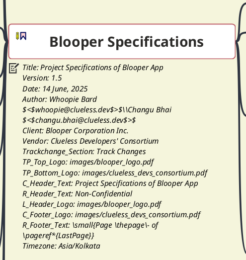|

Following is a sample metadata text-block stored as note-text of root node of a sample mindmap. The descriptions given in parentheses against each value is for information purpose only, and they should not be included in the root node. You may modify any of these values in your mindmap, and they would be reflected in the resultant PDF file. Also all parameters are not mandatory either. You may leave out the ones which doesn't make sense in your document.

---

```text
Version: 1.0  (document-version to be included on the title page)
Title: Project Specifications of Blooper App (document title)
Date: 21 January, 2025 (document-date to be printed on title page)
Author: Whoopie Bard $<$whoopie@clueless.dev$>$ (author-name with email)
Client: Blooper Inc. (client for whom project is being executed)
Vendor: Clueless Developers' Consortium (vendor who is executing the project)
Trackchange_Section: Track Changes (needs to prepare track-change-list and render it in a section as named here)
TP_Top_Logo: images/tp_top_logo.pdf (top-logo image path for title page)
TP_Bottom_Logo: images/tp_bottom_logo.pdf (bottom-logo image path for title page)
L_Header_Text: Blooper Inc. (page header text for top left if image is not supplied)
L_Header_Logo: images/page_top_left_image.pdf (page header image for top left if text is not supplied)
C_Header_Text: Project Specifications of Blooper App (page header text at top center if image is not supplied for it)
C_Header_Logo: images/page_top_center_image.pdf (page header image at top center if text is not supplied for it)
R_Header_Text: Non-Confidential (page header text at top right if image is not supplied for it)
R_Header_Logo: images/page_top_right_image.pdf (page header image for top right if text is not supplied)
L_Footer_Text: created by fp-convert (page header text for bottom left if image is not supplied)
L_Footer_Logo: images/page_bottom_left_image.pdf (page header image for bottom left if text is not supplied)
C_Footer_Text: Clueless Developers' Consortium (page header text at bottom center if image is not supplied for it)
C_Footer_Logo: images/page_bottom_center_image.pdf (page header image at bottom center if text is not supplied for it)
R_Footer_Text: \small{Page \thepage\- of \pageref*{LastPage}} (page header text for bottom right if image is not supplied)
R_Footer_Logo: images/page_bottom_right_image.pdf (page header image for bottom right if text is not supplied)
Timezone: Asia/Kolkata (timezone - default is UTC - to be used while calculating timestamps, if any)
```

---
The page number format shown above for right-footer-text is using the LaTeX macros \thepage and \pageref\*{LastPage}. It prints the text "Page X of Y" on every page, where X is the current page-number, and Y is the total number of pages in the document. You may use the value "\small{\thepage} if you want only the current page-number to be printed on every page.

The credit text "Prepared using [fp-convert](https://github.com/kraghuprasad/fp-convert)" would be automatically included in the footer of every page by default. If you do not want that, then you need to supply some text (or image) for all the three footer blocks, namely left (L_Footer\_\*), center (C_Footer\_\*), and right (R_Footer\_\*) as shown in the example given above. If you want certain blocks to be kept empty, but do not want it to be auto-filled using the credit-text mentioned above, then please ensure that all the keys used for defining footer-texts (\*\_Footer_Text) are either supplied with some valid values or with %%; provided no images are defined for those sections either. For example, if there are no images supplied for left section of the footer, and no text is supplied for it either, then the credit text would be automatically included there. But if you supply %% as value for L_Footer_Text, then that section would be left empty. Please note that this trick is possible only with keys used for specifying the text parts of the footer. If you are using any keys meant for specifying the logo (image) paths, then they must be supplied with proper image-paths, i.e. fp-convert doesn't accept %% as values for any of them.

The geometry, colors etc. can be modified too, but using a different configuration mechanism. If you are using fp_convert module in your python program, then you can create respective configuration classes Config, Main, StopFrame, ColorBox, FancyBox, FancyBox2, Table, DBSchema, UML, etc. When executing the program on commandline you may supply a YAML based configuration file to it to define those configuration parameters. The command-line option -c should be used to supply the YAML based configuration file while invoking fp-convert. The details of configuration file is given in the following section.

## Control Rendering Parameters

Various document-parameters can be controlled using a configuration file, which can be supplied using -c option on command-line. A sample configuration can be generated using the -g command-line option too. Following is the content of a sample configuration file which can be used while generating the PDF from a mindmap. The details of each parameter is provided as an in-line comment on the same line.

---

```yaml
# Configuration parameters of fp-convert. You may modify it to suit your needs.
# While doing so, do not forget to supply the path to your YAML file with
# commandline argument -c while executing fp-convert.

# Primary configuration parameters for the document
main:
  bottom_margin: '1.5in' # Bottom margin (with unit)
  del_mark_color: 'red!80!gray' # Color of trash-markers for nodes marked for deletion
  del_mark_flag: '\faCut' # Fontawesome symbol to indicate removed element
  del_mark_text: 'CUT' # Text to be displayed against removed element
  figure_width: '0.6\textwidth' # Figure-with for all figures as a factor of text-width
  file_color: 'magenta' # Color of file-links used in the document
  footer_line_color: 'airforceblue' # Color of footer line of the document
  footer_thickness: '0.4' # Footer line thickness
  header_line_color: 'airforceblue' # Color of header line of the document
  header_thickness: '0.4' # Header line thickness
  head_height: '25pt' # Head height (with unit)
  inner_margin: '1.25in' # Inner margin (with unit)
  left_margin: '1.25in' # Left margin (with unit)
  link_color: 'celestialblue' # Color of hyperlinks in the document
  mc_color: '{rgb}{0,0.5,0}' # Color of margin comment-links in the document
  new_mark_color: 'cobalt' # Color of new-markers used for newly added nodes
  new_mark_flag: '\faPlus' # Fontawesome symbol to indicate newly added element
  new_mark_text: 'NEW' # Text to be displayed against newly added element
  outer_margin: '1.25in' # Outer margin (with unit)
  par_indent: '0pt' # Paragraph indentation (with unit)
  par_title_format: '[hang]{\normalfont\normalsize\bfseries}{\theparagraph}{1em}{}' # Specifications for additional paragraph section
  par_title_spacing: '{0pt}{3.25ex plus 1ex minus .2ex}{.75em}' # Title spacing for paragraph section
  right_margin: '1.25in' # Right margin (with unit)
  sec_depth: 5 # Maximum depth allowed in sectioning of the document
  subpar_title_format: '[hang]{\normalfont\normalsize\bfseries}{\thesubparagraph}{1em}{}' # Specifications for additional subparagraph section
  subpar_title_spacing: '{0pt}{3.25ex plus 1ex minus .2ex}{.75em}' # Title spacing for subparagraph section
  timezone: 'UTC' # The timezone to be used to generate timestamps in document
  toc_depth: 3 # Maximum depth allowed in table of contents listing
  top_margin: '1.5in' # Top margin (with unit)
  tp_bottom_logo_height: '1.5cm' # Height of bottom logo on title page
  tp_bottom_logo_vspace: '7cm' # Vertical space between bottom logo and title text on title page
  tp_top_logo_height: '3cm' # Height of top logo on title page
  tp_top_logo_vspace: '5cm' # Vertical space between top logo and title text on title page
  url_color: 'ceruleanblue' # Color of URLs used in the document

  # Height of various images used in header and footer of pages
  c_footer_image_height: '0.5cm' # Center footer image height in all pages (with unit)
  c_header_image_height: '0.5cm' # Center header image height in all pages (with unit)
  l_footer_image_height: '0.5cm' # Left footer image height in all pages (with unit)
  l_header_image_height: '0.7cm' # Left header image height in all pages (with unit)
  r_footer_image_height: '0.5cm' # Right footer image height in all pages (with unit)
  r_header_image_height: '0.5cm' # Right header image height in all pages (with unit)
 
# Stop-frame specific parameters
stopframe:
  background_color: 'red!5!white' # Background color of the Stop-Frame
  inner_left_margin: '5pt' # Stop-Frame inner left margin width (with unit)
  inner_right_margin: '5pt' # Stop-Frame inner right margin width (with unit)
  line_color: 'cadmiumred' # Color of the boundary lines of the Stop-Frame
  outer_left_margin: '5pt' # Stop-Frame outer left margin width (with unit)
  outer_line_width: '1pt' # Stop-Frame outer line-width size (with unit)
  outer_right_margin: '5pt' # Stop-Frame outer right margin width (with unit)
  round_corner_size: '3pt' # Stop-Frame rounded corner's size (with unit)

# Parameters specific to tables with textual and numerical data in the document
table:
  footer_row_color: 'babyblueeyes!10'  # Footer row color for default table
  header_row_color: 'babyblueeyes!60'  # Header row color for default table
  header_text_color: 'darkblue' # Header text color for default table
  line_color: 'cornflowerblue'  # Color of lines shown in default table
  rowcolor_1: 'babyblueeyes!30' # Row color 1 of alternate row colors for default table
  rowcolor_2: 'babyblueeyes!10' # Row color 2 of alternate row colors for default table
  rowcolor_3: 'lightapricot!50' # Row color 3 is for rendering the row containing deliverable-name
  rowcolor_4: 'lightapricot!30' # Row color 4 is to render the rows in deliverable-table
  rowcolor_5: 'lightapricot!10' # Row color 5 is to render the rows in deliverable-table

# Parameters specific to database schema blocks
dbschema:
  table_name_text_color: 'darkblue'  # Color of table-schema header-text(table-name)
  tbl_header_line_color: 'fpcblue2'  # Header line color for dbschema-table
  tbl_header_row_color: 'fpcblue1'   # Header row color for dbschema-table
  tbl_header_text_color: 'darkblue'  # Header text color for dbschema-table
  tbl_rowcolor_1: 'white'            # Odd row background color of dbschema-table
  tbl_rowcolor_2: 'tealblue!7!white' # Even row background color of dbschema table
  bullet_label_separation: '0.3em'   # Space between bullet and text in note-list
  additional_field_types: # These column-types would be accepted in addition to default ones
    - 'geometry'
    - 'geography'

# UML diagram specific parameters
uml:
  actor_background_color: '#d8f0fd' # Background color of UML actor images
  actor_border_color: '#4e98c4' # Border color of UML actor images
  actor_color: '#4e98c4' # Color of UML actor images
  background_color: '#ffffff' # Background color of UML diagrams
  component_background_color: '#ffffff' # Background color of UML components
  component_border_color: '#000000' # Border color of UML components
  component_color: '#d0d0d0' # Color of UML component images
  connector_line_type: default # Line-type used in connectors in UML diagram
  default_text_alignment: left # Text alignment used in UML diagrams
  note_background_color: '#f7f3de' # Background color of UML notes
  note_border_color: '#867c1c' # Border color of UML notes
  note_color: '#c0c0c0' # Color of UML notes
  package_border_color: '#3a2f2f' # Border color of UML package diagram
  package_color: '#ebf6fa' # Color of UML package diagram
  plantuml_cmd: /usr/bin/plantuml # Full path of plantuml executable
  usecase_border_color: '#0542C5' # Border color of UML usecase diagram
  usecase_color: '#b1dafc' # Color of UML usecase diagram
  usecase_diagram_width: '0.9\textwidth' # Width of UML usecase diagram

# Colorbox specific parameters
colorbox:
  background_color: 'blue!5!white'  # Background color of colorbox
  box_arc_size: '2.5mm'             # Arc size of colorbox
  box_rule_width: '0.8pt'           # Rule width of colorbox
  frame_color: 'blue!75!black'      # Frame color of colorbox
  left: '5mm'                       # Left margin of colorbox
  right: '5mm'                      # Right margin of colorbox
  top: '2mm'                        # Top margin of colorbox
  bottom: '2mm'                     # Bottom margin of colorbox

# Fancybox parameters used to render risks
fancybox:
    title_color: 'black'
    title_font: '\bfseries\large'
    title_background_color: 'red!20!white'
    title_frame_color: 'red!80!white'
    # title_attributes: 'sharp corners'
    title_attributes: 'rounded corners'
    title_position: 'top left'
    title_xshift: '1.5mm'
    title_yshift: '-1mm'
    title_drop_shadow: 'false'
    title_bullet: '\faChevronCircleRight'
    frame_bg_color: 'red!5!white'
    frame_color: 'red!80!white'
    frame_arc_size: '1mm'
    frame_rule_width: '0.8pt'
    frame_width: '0.9\textwidth'
    frame_left_margin: '6pt'
    frame_right_margin: '6pt'
    frame_top_margin: '6pt'
    frame_bottom_margin: '6pt'
    frame_alignment: 'center'  # left, center or right
    frame_drop_shadow: 'false'

# Fancybox parameters used to render deliverables
fancybox2:
    title_color: 'white'
    title_font: '\bfseries\large'
    title_background_color: 'purple!70!black'
    title_frame_color: 'purple!70!black'
    # title_attributes: 'sharp corners'
    title_attributes: 'rounded corners'
    title_position: 'top left'
    title_xshift: '1.5mm'
    title_yshift: '-1mm'
    title_drop_shadow: 'false'
    title_bullet: '\faChevronCircleRight'
    frame_bg_color: 'white'
    frame_color: 'purple!70!black'
    frame_arc_size: '1mm'
    frame_rule_width: '0.8pt'
    frame_width: '0.85\textwidth'
    frame_left_margin: '6pt'
    frame_right_margin: '6pt'
    frame_top_margin: '6pt'
    frame_bottom_margin: '6pt'
    frame_alignment: 'center'  # left, center or right
    frame_drop_shadow: 'false'
    table_rowcolor_1: 'lightapricot!50'
    table_rowcolor_2: 'lightapricot!30'
    table_rowcolor_3: 'lightapricot!10'
    table1_width: '\textwidth' # width for tabled-content
    table2_width: '\textwidth' # width for child-node-content
    hrule_width: '0.4pt' # width of horizontal rule inside this box

# The translation-text used in the rendered document. You may change
# to suitable ones, if you want to render the content in language other
# than English.
translations:   # Translations for auto-filled segments of the document
  deliverable: 'Deliverable'
  deliverable_id: 'Deliverable-ID'
  accountable: 'Accountability'
  delivery_date: 'Date of Delivery'
  risk_types: 'Risk-Types'
  risk_id: 'Risk-ID'
```

---

All colors mentioned in this configuration file can be modified too. The list of color-names allowed to be used with fp-convert are available [here](https://kraghuprasad.github.io/fp-convert/docs/colors.html). No other color-names can be used, unless you opt to modify the generated LaTeX file and recompile it yourself. In that case you can use all colors supported by the TeX/LaTeX packaged available in your OS-distro. One or more of these colors can also be mixed with other colors. For example "red!25!white" can be used to get a lighter shade of red by mixing it with white. The color-mixing scheme used is taken from LaTeX package xcolor. If you want to learn more about xcolor and how it can be used in LaTeX documents, then you may read [this](https://ctan.math.washington.edu/tex-archive/macros/latex/contrib/xcolor/xcolor.pdf).

## Sections, Subsections, and More

| |
|:-:|
|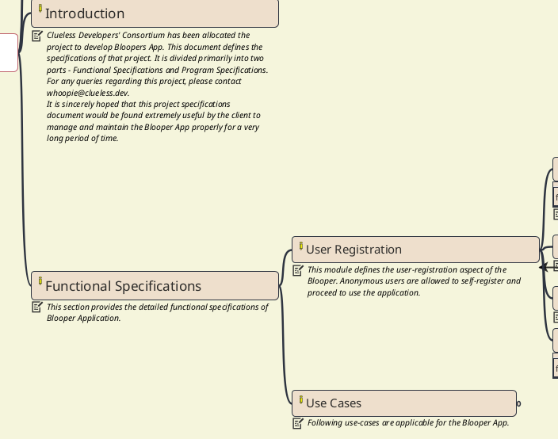|

Except root node, all following nodes in a mindmap are treated as sections, subsections, subsubsections and more based on the node-hierarchy. You can only go upto the section-depth of 5 in your mindmap. If that limit is crossed, fp-convert would raise the error mentioning that maximum section-depth has reached. Under this scheme, the node's text is treated as header of respective sections, and the note-text in each of them are rendered as section-content.

| |
|:-:|
|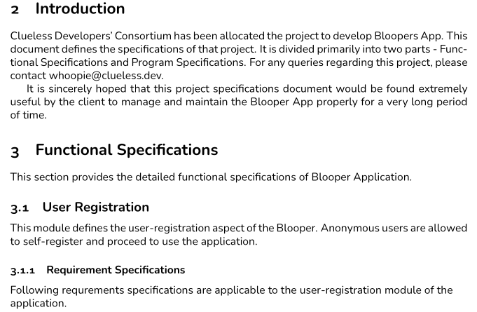|

As you can notice in images shown above, every line-break in the note-text of such node is taken as the start of a new paragraph in respective section.

If a node is to be treated in a different way, it should be annotated suitably by providing a valid-value to the node-attribute `fpcBlockType` as described in the following sections.

## Watermarks

| |
|:-:|
|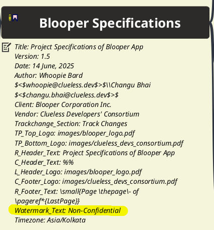|

By supplying watermark text in document-info (supplied as root-node's note-text), you can render it in every page of the PDF generated by fp-convert. Various parameters of watermark-text, like its scaling factor, font-style, angle of text, color of text, etc. can be fine-tuned via fp-convert.yml file which is used for rendering the document at runtime. Following parameters are supported in the configuration file (sample values for each are also provided for reference):

```YAML
main:
  watermark_color: 'orangepeel!20'            # color of the watermark-text (highly faded colors are preferred)
  watermark_angle: '0'                        # angle of the watermark-text in degrees
  watermark_scale: '0.2'                      # scaling factor used to render watermark-text (1 is too huge)
  watermark_font_family: '\sffamily\bfseries' # font-family used to render watermark-text
  watermark_center_x: '0.5\paperwidth'        # center point of watermark-text on X-axis (also takes mm, cm, in, pt as units)
  watermark_center_y: '0.95\paperheight'      # center point of watermark-text on Y-axis (also takes mm, cm, in, pt as units)
```

The resultant rendering of the watermark-text is shown below. Based on the position of watermark-text defined above, it gets rendered at the horizontal center at the bottom of every page of the document. You may position this text anywhere on the page at any angle by varying the values supplied to parameters `watermark_center_x`, `watermark_center_y` and `watermark_angle`. 

| |
|:-:|
|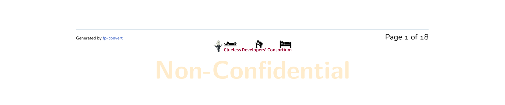|

## Pagebreaks

| |
|:-:|
|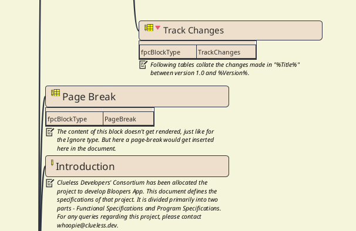|

By setting the attribute `fpcBlockType` of a node to `PageBreak`, the content of the next node can be moved to a new page, as shown below.

| |
|:-:|
|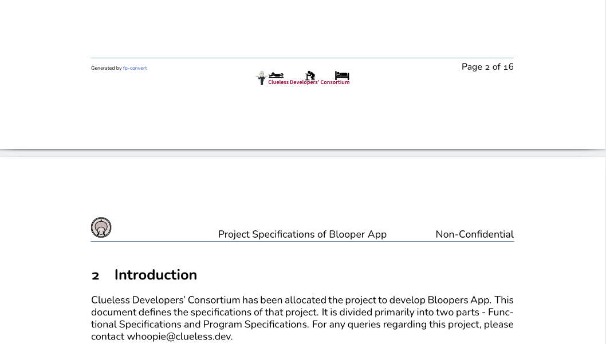|

## Unordered Lists

| |
|:-:|
|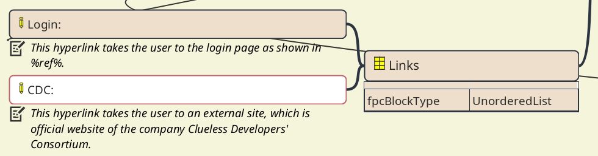|

If a node is annotated with its attribute `fpcBlockType` set to `UnorderedList`, a bullet-list (generated by LaTeX's `itemize`) is created. If there are child nodes for one ore more items of this list, then they would be rendered in nested lists, each of them being an unordered list. If the content of any items in a list is to be shown in bold case font, then that content should be ended with a colon(:). If the same content contains a colon(:) somewhere in the middle of the text, then LHS of that colon is rendered in bold case font, and the RHS in normal case. The note-text of child nodes too would be rendered in one or more paragraphs, as part of the list item. Every line of the note-text would become a paragraph in the resulting document.

| |
|:-:|
|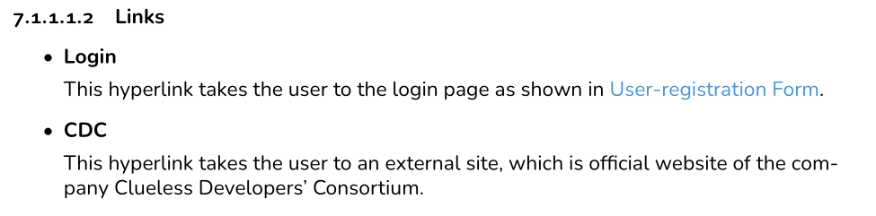|

## Ordered Lists

| |
|:-:|
|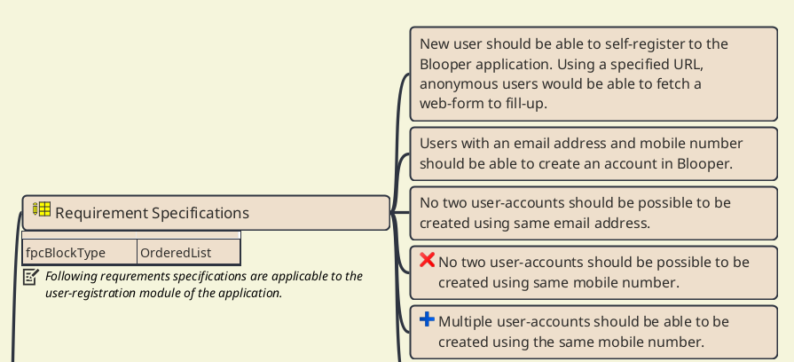|

If attribute `fpcBlockType` of a node is assigned a value `OrderedList`, then the list created from the contents of the direct children of that node would be a ordered (numbered) list. LaTeX's `enumerate` is used to create the ordered list block. Rest of the behaviour would remain same as in unordered list. Please note that the nested list created from the child node or its children would be rendered as ordered list, unless any of them are annotated to be unordered list. Then that behaviour would continue down the line.

| |
|:-:|
|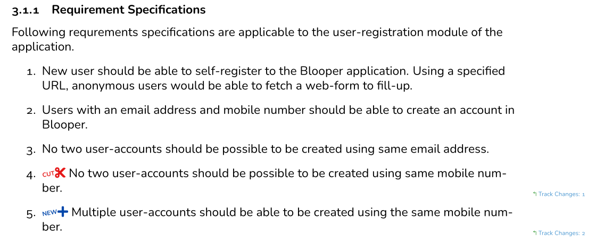|

If the parent node of a node has its attribute `fpcBlockType` assigned the value `OrderedList` or `Unorderedlist`, then further nodes need not be annotated similarly to create nested lists. Adding child nodes to any of the list-item would result in creating them automatically. The type of such lists are inherited from the parent list, to which it belongs to, unless explicitly overridden.

Here too, the convention for rendering text in bold case is to end the intended phrase with a colon.

## Tracking Changes Manually
| |
|:-:|
|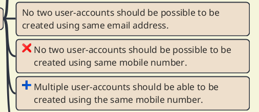|

The changes between two versions of the same mindmap and its resultant documents can be tracked manually by adding suitable icons to the node being created afresh or marked for removal. The additions should be marked with Plus() icon and removals should with Cross() icon. They result in prepending respective markers for additions and proposed removals. Examples are shown in the above diagram which is rendering two items of the ordered list with those markers prefixed to them. These markers contain any plain text and fontawesome icons. They are customizable too. You may supply different text and icons for the same purpose by modifying the YAML based configuration file supplied to fp-convert. The resultant document-segment rendering node-content from mindmap is shown below.

| |
|:-:|
|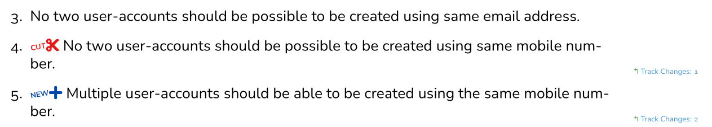|

Whenever trackchange-specific icons are found for a section, or list-item in the generated document, the readers are expected to presume that based on their type either the section was newly included in the document, or the content of concerned block and all of its children are marked for removal from the document in future. This would be of great help while preparing any system-specifications document. It would be a good practice to indicate such blocks of text before they are actually newly added in this version of the document, or marked for removal in the next version of the same. As stated already, the actual text to be used for this purpose ("New", "Delete", "Deprecated", "To be Removed", etc.) can be defined via certain configuration parameters supplied in fp-convert.yml file before executing fp-convert.

As explained in the following section, a track-change table would be created automatically by supplying a suitable section-name for it as the value of the key `Trackchange_Section` in the note-text of the root node of the mindmap. If track-change is enabled, then every element with addition/removal marker texts would get a hyperlink to the corresponding section in the track-change table in the margin note of the page where those contents get rendered. The two margin-notes based hyperlinks found in the above image are examples of such references.

## List of Track Changes

As discussed earlier, you may annotate certain nodes as newly added, and some others as marked for removal. They would be duly indicated in the document with appropriate icons and marker texts. It is also possible to collate a list of all such changes and render them in a neat table along with respective hyperlinks for cross-referencing. For rendering this table, you need to supply the key `Trackchange_Section` in document's meta data in the notes of its root node. The value supplied for this key would be used to name a section created at the end of the document for rendering the list of all those changes in a tabular view.

| |
|:-:|
|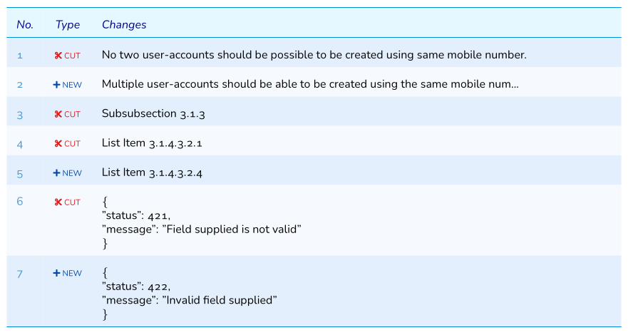|

If you want to position this section as a named node in some other parts of the document - like in the beginning of the document itself - then create a node with appropriate section-name, and set its attribute `fpcBlockType` to `TrackChanges`. In this case the value supplied against the key `Trackchange_Section` in the document's meta data would be ignored and the table would be rendered in the position where this particular node is defined. Please note that if you annotate more than one node to render the track-changes, then an exception would be raised asking you to keep only one such node in the mindmap. Also, if you do not supply the key `Trackchange_Section` in the document's meta data, then even annotating any node's attribute `fpcBlockType` with `TrackChanges` would not generate the intended table anywhere in the document.

## Table with Textual and Numerical Content

By providing `Tabular` as value for the attribute `fpcBlockType` for a given node, a table with textual and numerical content can be built. The rules applicable to construct nodes for a table are elaborated in this section.

There should be only two child node duly annotated as `ColumnHeaders` and `TableData` for their respective attributes `fpcBlockType`. The former contains details for headers, and the later for actual data to be stored in the table.

| |
|:-:|
|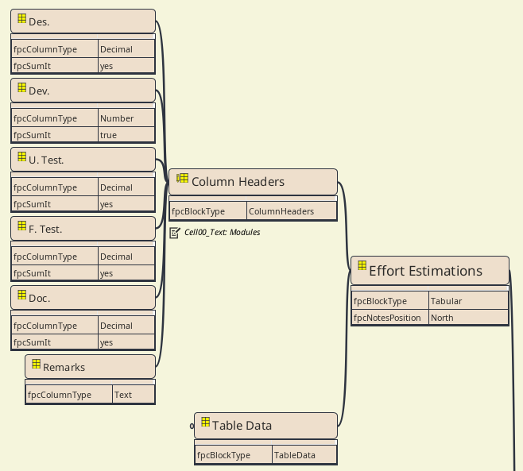|

The number of child-nodes in the column-headers section indicates the number of data columns to be rendered in the table. The first column of the rendered table will automatically hold the row-header's content, which are fetched from the children (first-level) of the table-data node. The child-nodes of the column-headers node can possess two attributes, namely `fpcColumnType` (values can be `Text` `Int`, `Float`, or `Decimal`, etc.) and `fpcSumIt` (values can be `Yes`, `No`, `True`, `False`, etc.) The former indicates the type of data getting stored in the cells of the column, and the later flags whether summing of those values are required or not. If required, then the summed-up value for that column would be placed in the last row of it, provided they all contain numerical values. Supplying non-numerical values for columns specified as numerical ones would raise errors during the document-conversion process.


The text found in these nodes would be placed in the first row of the table as column-headers. The length of the text should be manually inspected to ensure that it doesn't get overflowed outside the allowed page-width. This width-overflow is not checked or prevented by fp-convert. The note-text -- if any -- found in this node must be of form `Cell00_Text: xxx` and nothing more. Please note that this is a breaking change from version 0.3.x where the earlier format of it was `Column1: xxx`. This format is not supported anymore. The `Cell00` refers to the top-left cell (row 0, column 0) of the table. The value xxx would be placed into the first cell of the table in its first row, when the table gets rendered. Otherwise this cell would remain empty.


| |
|:-:|
|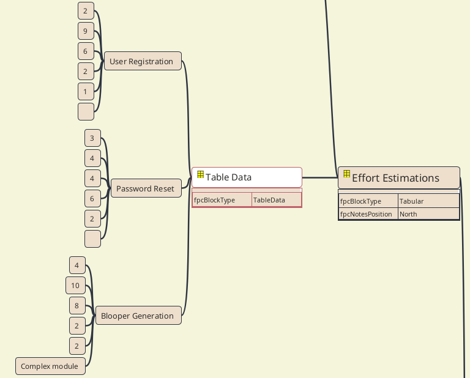|

The children of table-data nodes must have only two levels. The text of the first-level children would be rendered as row-headers. For each of such nodes, there must be child-nodes with their respective content matching the types defined in their respective header-nodes earlier. The number of such nodes must match exactly with the number of column-headers. Even if some cells do not contain data, the nodes for them should be included with no content.

The content for the last row of the table would be computed based on whether summing of respective column-data was sought or not. If summing was not requested for certain column, those cells of the last row would remain empty.

All number-values and their sum would be right-aligned in the table-cells, if their column-headers were annotated for data-types like `Int`, `Percentage`, `Decimal`, etc. Otherwise the cell-content would be left aligned. At present there is no option available to center-align the cell-content in a number-table.

| |
|:-:|
|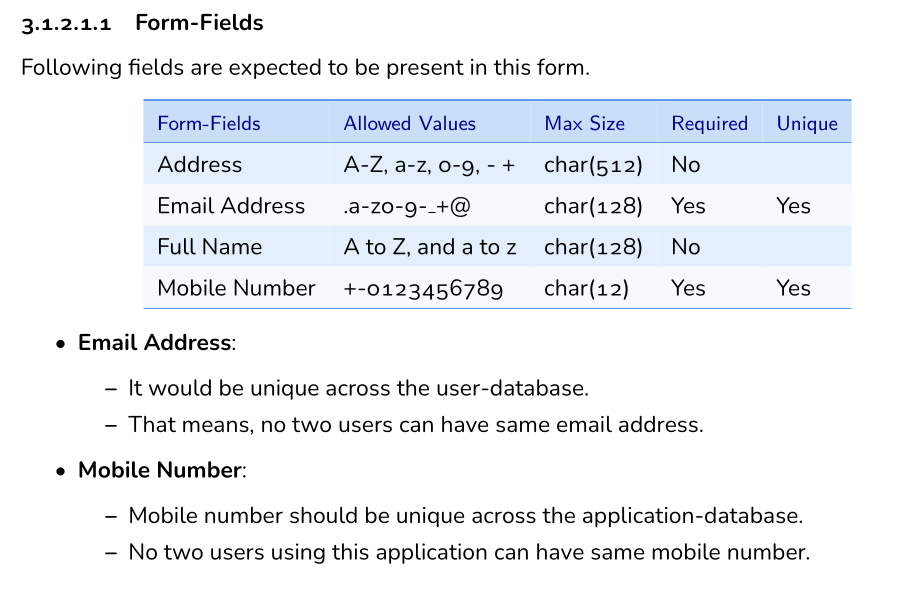|

## Code Blocks in Nodes

| |
|:-:|
|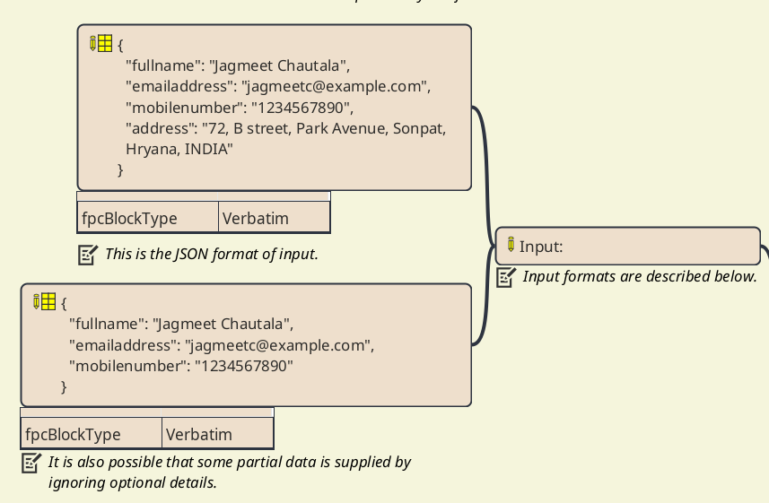|

By annotating any node's attribute `fpcBlockType` as `Verbatim` one can render a verbatim block in fixed-font. It is built using LaTeX's verbatim environment. This kind of rendering is preferred to display code blocks like HTML, CSS, JSON, XML, and many more in the field of computing. The content of whole node would be rendered in fixed-width font and all linebreaks would be rendered as it is too.

| |
|:-:|
|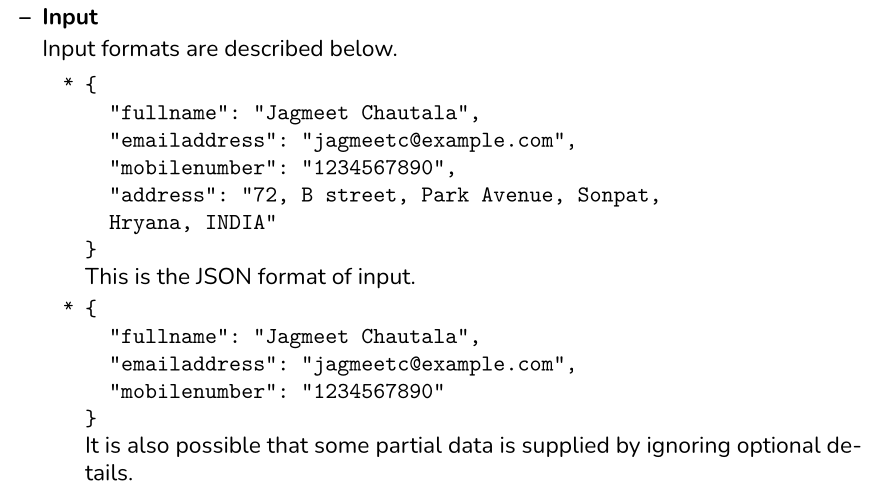|

## Code Blocks in Notes

| |
|:-:|
|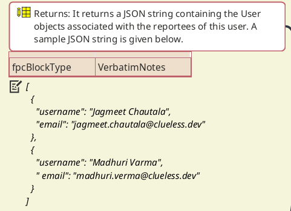|

By annotating any node's attribute `fpcBlockType` as `VerbatimNotes` the notes of that node gets rendered in fixed-font style. This too is built using LaTeX's verbatim environment. It can be used in cases where description-text of the code-block is to be shown above the code-block itself. Here the description is provided as node-text and code-blocks of HTML, CSS, JSON, XML, etc. are put as note-text of the same node.

| |
|:-:|
|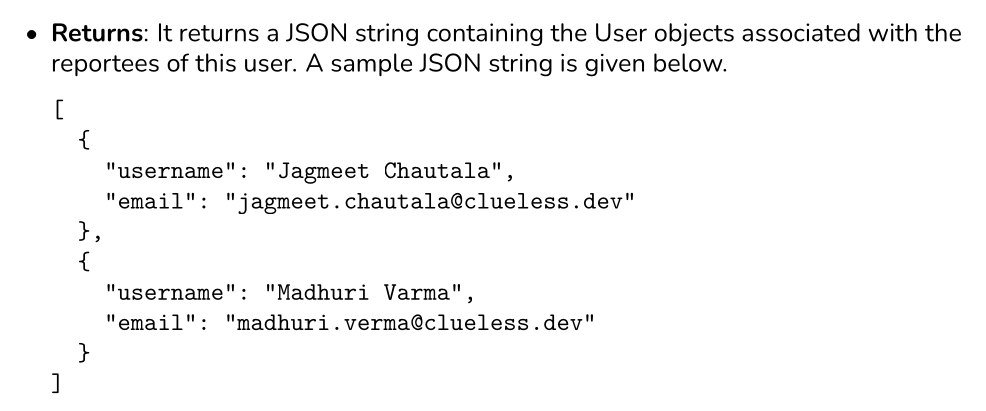|

## Images

| |
|:-:|
|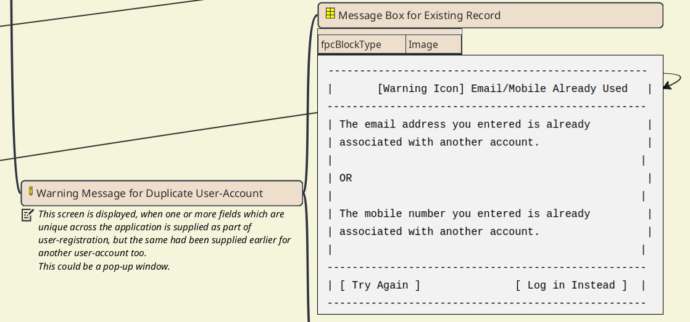|

An image can be rendered by setting its attribute `fpcBlockType` to `Image`. That image would be put in the applicable section or subsection of the document, to which that node belongs. The raster image formats like JPEG and PNG are supported. If you want to use vector graphics, then attach SVG based images to the node. They would be auto-converted to PDF and then used in the resultant PDF document. Please note that attaching large raster graphics like JPEG, PNG etc. to the mindmap may considerably increase the size of the resultant PDF document. To prevent that, try to use SVG images of small sizes, wherever possible.

| |
|:-:|
|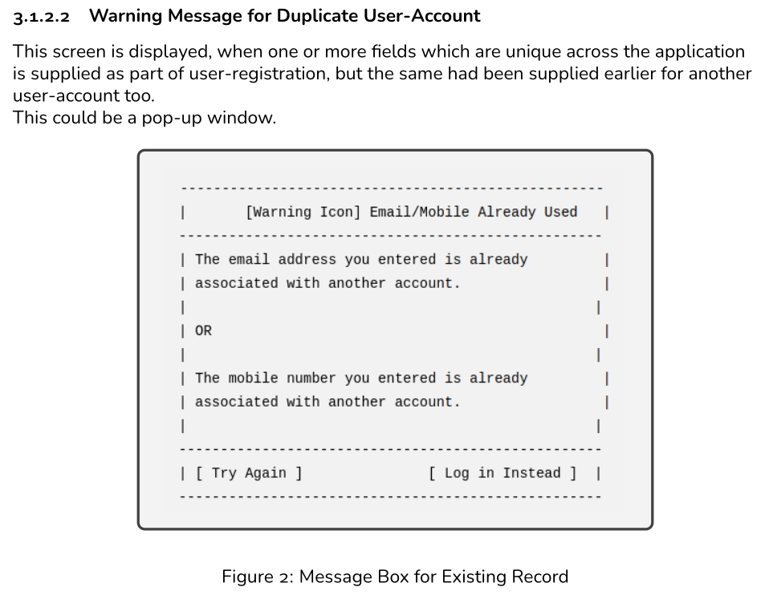|

## Warnings

| |
|:-:|
|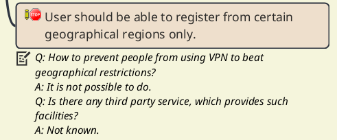|

If some kind of warning-text is to be rendered, then that node should be annotated with stop icon (), and required warning-text should be placed as a note in that node. This text would be rendered prominently by fp-convert in a frame-box. This annotation should be used mainly for sections where some kind of questions or doubts are to be raised and marked in the document for some further actions.

| |
|:-:|
|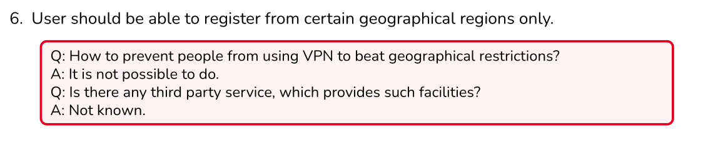|

## Database Schema

| |
|:-:|
|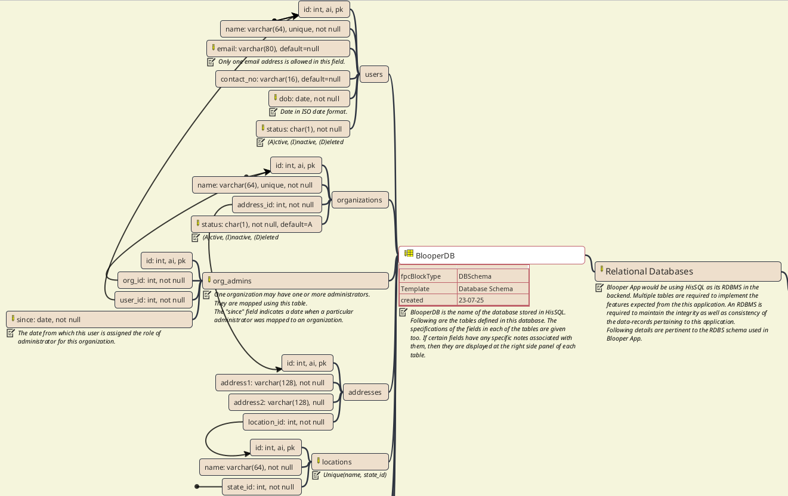|

If a particular node is annotated with `DBSchema` as value for its attribute `fpcBlockType`, all children of it would be used to render the schema of a database.

There are certain conventions to be followed while preparing a database schema using the mindmap. They are mentioned below:

- All nodes which are direct children of this annotated node are treated as names of the database tables.
- All child nodes of those table-nodes are treated as names of the fields in that table.
- The field-nodes must be written following certain conventions, which are listed below:
  - The structure of the text in fields must be of the form `field_name: field_options`
  - The field-options must be separated with commas(,).
  - If an outgoing arrow from a field goes to another field of same or different table, then the former is treated as a foreign key field. Logically the foreign-key should not point to any field-nodes which are not under node used to build the current database schema.
  - If an incoming arrow comes to a field from another field, then it is assumed that the former is the primary key field of the table under which it is defined.
  - The arrows from nodes which are part of DB schema should not point to any node which lie outside the starting node of that schema. Also, the behavior of incoming arrows to any table-node from nodes which are not part of the same DB schema is not well defined at the moment. Same is the case for field-nodes too.
  - The field-options can be one or more of the following, duly separated by commas:
    - pk: Primary Key
    - int: Integer data type
    - integer: Integer data type
    - enum: Enum data type
    - tinyint: 8 bit integer
    - smallint: Small sized integer
    - mediumint: Medium sized integer
    - bigint: Big integer
    - int8: 8 bit integer
    - int16: 16 bit integer
    - int32: 32 bit integer
    - int64: 64 bit integer
    - text: Text
    - geocolumn: Lat-Long data type
    - char(N): N number of characters
    - varchar(N): N number of varchar type data
    - bool, boolean: Boolean data type
    - float: Single precision floats
    - double: Double precision floats
    - real: Real number
    - decimal: Decimal number
    - json: JSON data
    - date: Date
    - datetime: Timestamp
    - ai: Autoincrement
    - unique: The value of this field must be unique within the table
    - default: Default value for this field
    - null: The value is nullable
    - not null: The value can not be null

The content of the node annotated with `DBSchema` and its children in the image shown above gets rendered into table-views in the PDF generated by fp-convert. They are shown below.

| |
|:-:|
|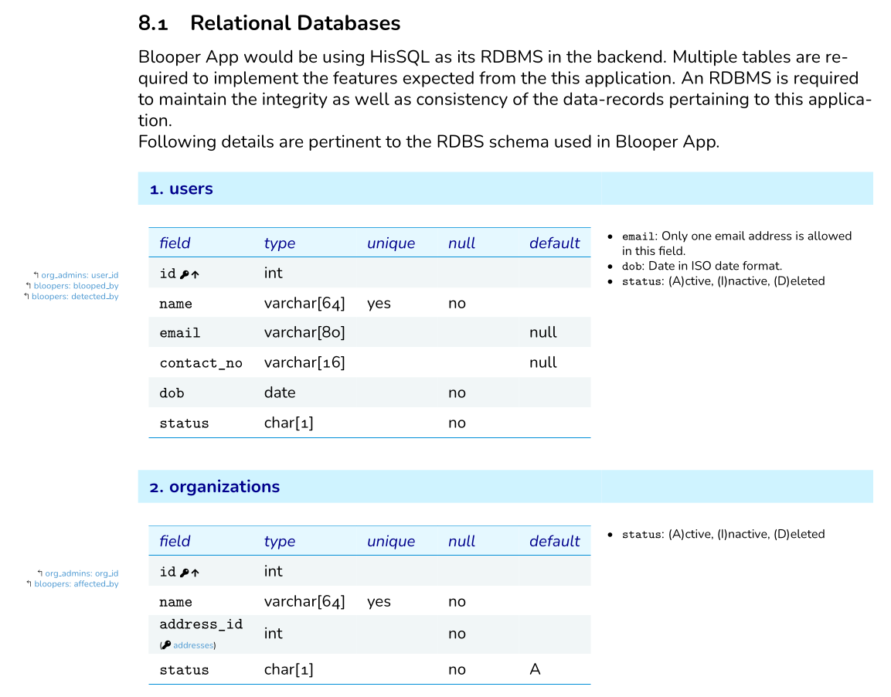|

| |
|:-:|
|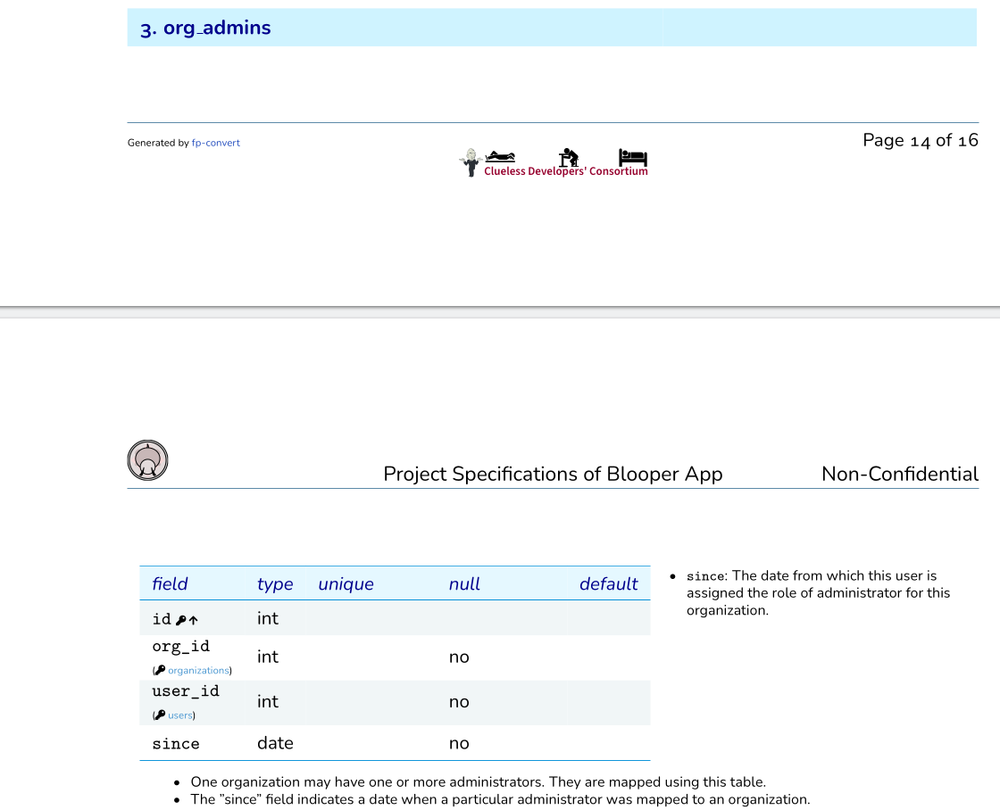|

| |
|:-:|
|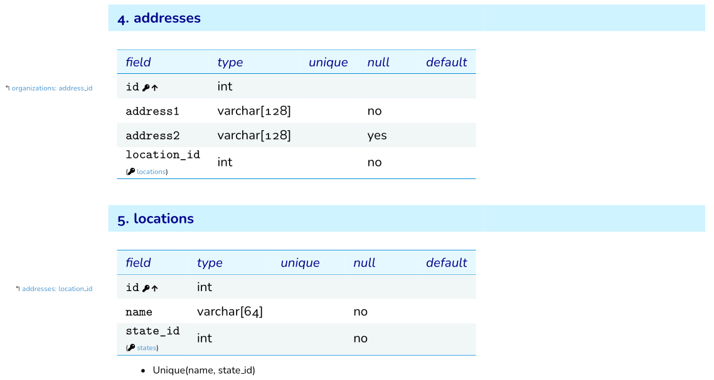|

## UML Usecase Diagrams

You can generate high-quality vector diagrams of usecases from your mindmaps by annotating the nodes with UML specific values. For example, you may define a set of actors in your mindmap by setting the value of the attribute `fpcBlockType` of a node to `UCActors` as shown below.

| |
|:-:|
|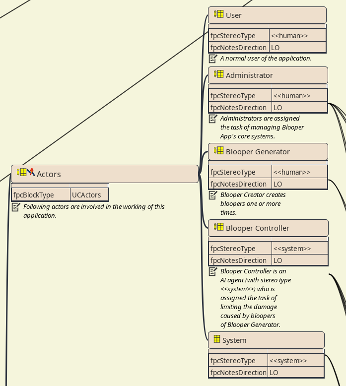|

The parent node, holding them can be marked to be ignored using a broken-line icon, so that it won't get rendered in the resultant document. This node must exist to create usecase diagrams containing different actors defined in it.

The child-nodes of this node can contain two attributes each:

- `fpcStereoType`: Its value can be whatever stereotype you want to associated with this actor. For example, it can be <<human>> or <<system>>.
- `fpcNotesDirection`: The direction where note-text of this node should be placed relative to the UML actor symbol in the usecase diagrams. Based on its values, a talk-bubble containing respective note-text is created and placed near the actor symbol by fp-convert. The valid values for this attribute are:
  - `LO`: Left of actor symbol
  - `RO`: Right of actor symbol
  - `TO`: Top of actor symbol
  - `BO`: Bottom of actor symbol

In certain cases, the direction of placement of notes may not be exactly as specified in this attribute, as it may be affected by placements of other UML elements in the diagram being created. For example, even if you supply `BO` as its value, in some diagrams the note-text might get placed somewhere at the bottom, but not directly below the actor symbol. It depend on how [PlantUML](https://plantuml.com) builds the diagram; and fp-convert doesn't have any say on this.

| |
|:-:|
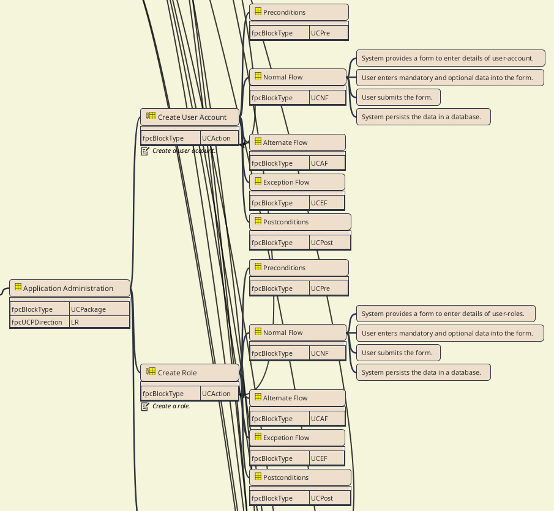|

The usecases can be defined in a mindmap by first annotating a node's `fpcBlockType` attribute to `UCPackage`. Another attribute `fpcUCPDirection` can be defined for this node with following valid values to indicate the directions in which the actors and usecase-actions should be laid out in the diagram:

- `LR`: Left to right
- `TB`: Top to bottom

Every child node of the usecase-package node should be annotated as `UCAction`. The actor-nodes involved in this usecase must be linked to those action-nodes via incoming arrow-links, as shown in the diagram.

There could be zero or more child nodes for each node of `UCAction` type. They are listed below (none of them are mandatory though):

- Preconditions: Attribute `fpcBlockType` is set to `UCPre`. Its child nodes should list all preconditions applicable for the usecase action.
- Normal Flow: Attribute `fpcBlockType` is set to `UCNF`. Its child nodes should list all steps involved in the normal flow of the usecase action.
- Alternate Flow: Attribute `fpcBlockType` is set to `UCAF`. Its child nodes should list all steps involved in the alternate flows of the usecase action.
- Exception Flow: Attribute `fpcBlockType` is set to `UCEF`. Its child nodes should list all steps involved for all possible errors anticipated in the usecase action.
- Postconditions: Attribute `fpcBlockType` is set to `UCPost`. Its child nodes should list all postconditions applicable for the usecase action.

Above-mentioned list of items are rendered in respective tables below the respective usecase diagram, as shown in the images of the rendered pages.

| |
|:-:|
|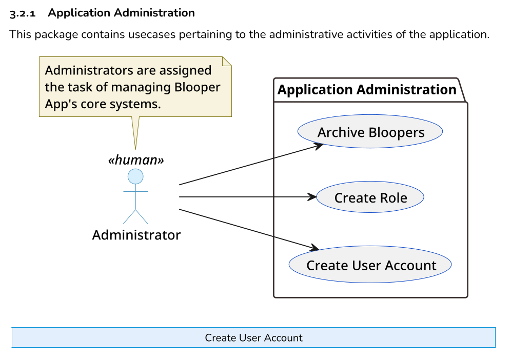|

| |
|:-:|
|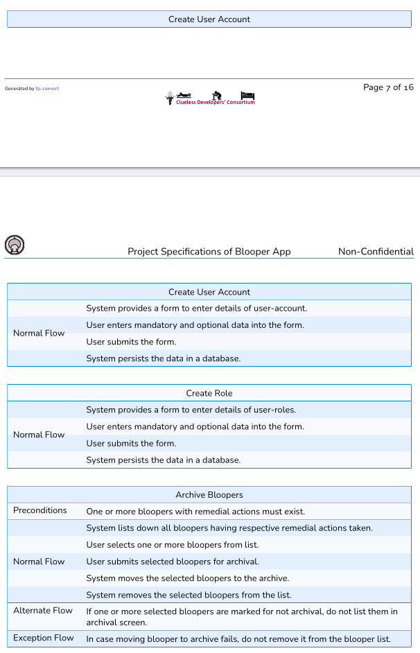|

## Deliverable

| |
|:-:|
|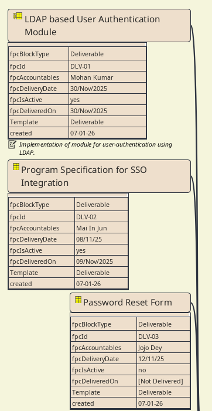|

When `fpcBlockType` attribute of a node is set to `Deliverable`, a deiverable-specific block gets rendered in the generated PDF document.

| |
|:-:|
|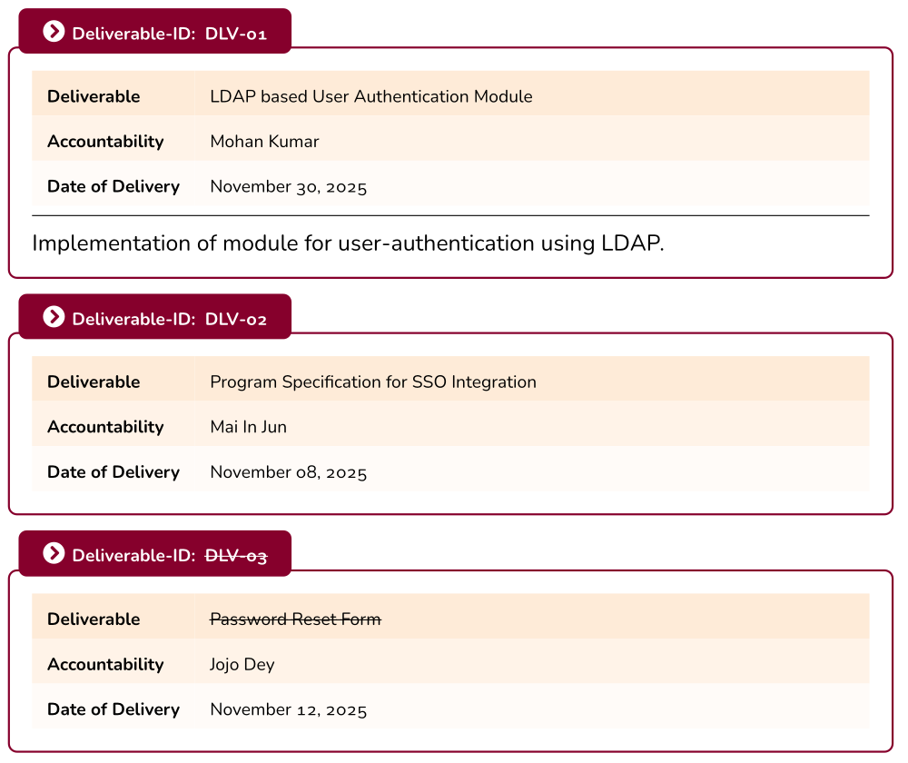|

The deliverable-block also takes following attributes to capture additional informaton pertaining to that delivery:

- `fpcId`: The ID for that deliverable. It is used to uniquely identify and track that deliverable while managing a project.
- `fpcAccountables`: One or more accountable person's names can be given here. If more than one person is made accountable, then their names should be separated by semi-colons(;).
- `fpcDeliveryDate`: The expected date of delivery. Please note that Freeplane takes the date-values and changes it based on the locale settings. For example, if date is specified as 09/06/2026, then it might get changed automatically as 09/06/26. This may cause ambiguity on whether we are setting the value 9 June 2026, or 6 September 2026. So it is preferred to make the date explicit, like 9 Sep 2026, or 09/Sep/2026, or September 9 2026, etc. The fp-convert would render all unambigously defined dates correctly as "<full-month-name> <date-number>, <year>". 
- `fpcIsActive`: It is a boolean value. If it is set to false, then the delivery-id and deliverable-name would be rendered "struck-through" in the document, as shown for Deliverable-ID DLV-03 in the image shown above.

## Risk

| |
|:-:|
|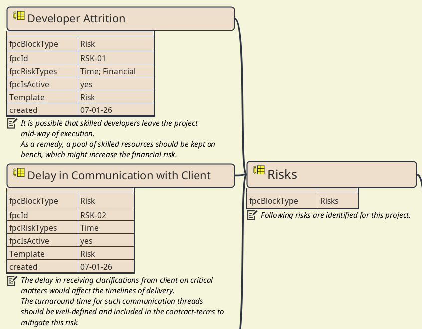|

A risk-type node gets its attribute `fpcBlockType` set to `Risk`. This results in details of such risks getting rendered prominently in the generated PDF as shown below.

| |
|:-:|
|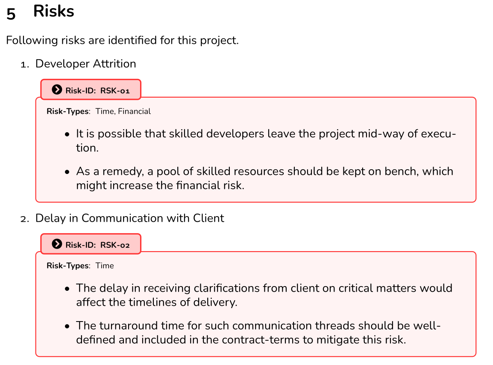|

The risk-type nodes may contain following additional attributes too:

- `fpcId`: The ID associated with this risk within the project-documentation. It could be used to identify, track and report the concerned risk properly for various compliance-needs.
- `fpcRiskTypes`: This could be one or more risk-types (maintained separately as a list node for risk-types in the same mindmap) associated with this risk. If more than one risk-types are to be listed, then they should be separated by semi-colons(;).
- `fpcIsActive`: It is a boolean value. If it is set to false, then corresponding risk-ID and details would be strugh-through (as explained in the case of deliverables above) while generating the PDF.

## Ignore Content-blocks

If a particular node is annotated with broken line icon (), or its attribute `fpcBlockType` is set to `Ignore`, then contents of it and all its children would be ignored while building the document.

## Additional Text

Besides rendering the contents of nodes, additional text can be included as note-text in each node. Depending on the which kind of node this note is attached to, those note-texts would be rendered too in the resultant PDF file. For example, in stop-frame (warning) type of nodes, the note-text would be rendered in a prominently colored box, but in a list-item or default node (which doesn't contain any annotations), it could be rendered as one or more paragraphs. In the latter case, each unbroken line of text is treated as a paragraph; i.e. a linebreak in the note-text would open a new paragraph.

## Templates for Defining Nodes

Once you start preparing mindmaps of various kinds, quickly it becomes quite a boring chore to set the attributes like `fpcBlockType` and others manually for each node. Fortunately, you can automate most of this work easily by installing [Dynamic Types Creator](https://github.com/i-plasm/freeplane-types-creator) script in Freeplane. The [template repository mindmap](https://github.com/kraghuprasad/fp-convert/blob/main/docs/examples/Template_Repository.mm), which is distributed as part of [fp-convert](https://github.com/kraghuprasad/fp-convert) defines various node-templates expected by fp-convert. The templates defined in it depends on [Dynamic Types Creator](https://github.com/i-plasm/freeplane-types-creator) script.

There are certain lists used in those templates, which eases data entry operations in the mindmap. For example list of People would provide selectable list inside the mindmap. The project-specific templates need a couple of lists predefined in the mindmap, as shown below.

| |
|:-:|
|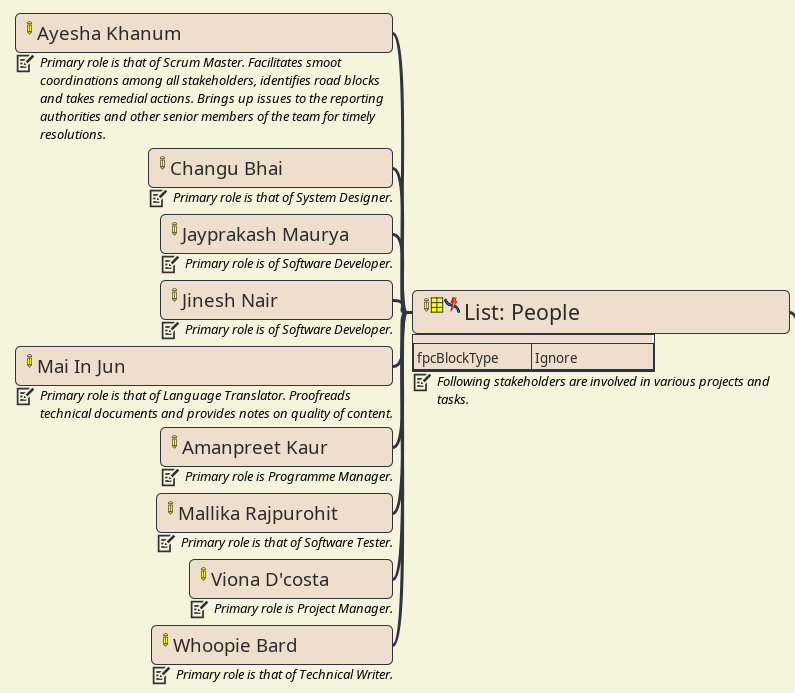|

| |
|:-:|
|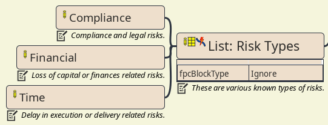|

[Dynamic Types Creator](https://github.com/i-plasm/freeplane-types-creator) script supports customized macros to be defined in the mindmap. Its documentation provides more details on supported macros. These macros are Ruby script snippets, which get executed, when respective script is executed on any node of the mindmap. Following is how today's date can be placed in the node-text, if required. This is used by the minutes of meeting related template provided in [template repository mindmap](https://github.com/kraghuprasad/fp-convert/blob/main/docs/examples/Template_Repository.mm).

| |
|:-:|
|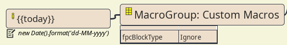|

Following sections elaborate various node-templates defined in [template repository mindmap](https://github.com/kraghuprasad/fp-convert/blob/main/docs/examples/Template_Repository.mm). These nodes must be present in the mindmap on which fp-convert is executed. If you include all nodes of the template repository, you can execute Dynamic Type Creator script on any node and get a list templates as shown below, from which you can choose the required one.

| |
|:-:|
|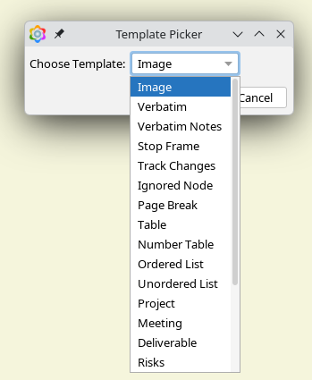|

### Common Templates

Certain common templates like Page-Break, Verbatim, Image, etc. are defined in this package.

| |
|:-:|
|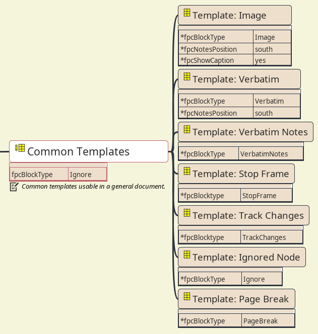|

### Table Templates

Templates for generic table and number table can be defined as shown below.

| |
|:-:|
|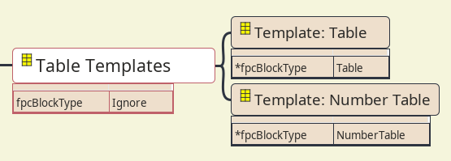|

### List Templates

Two kinds of lists, namely ordered and unordered lists can be created using respective templates defined in the mindmap containing the template repository.

| |
|:-:|
|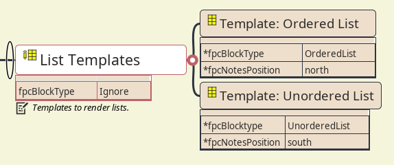|

### Project Templates

Few node-templates are defined for documenting project specifications, minutes of meetings, risks and deliverables, etc. The full list is given below:

- Project
- Meeting
- Deliverable
- Risk
- Database Schema

Following images describe how those templates are defined for each of the above.

| |
|:-:|
|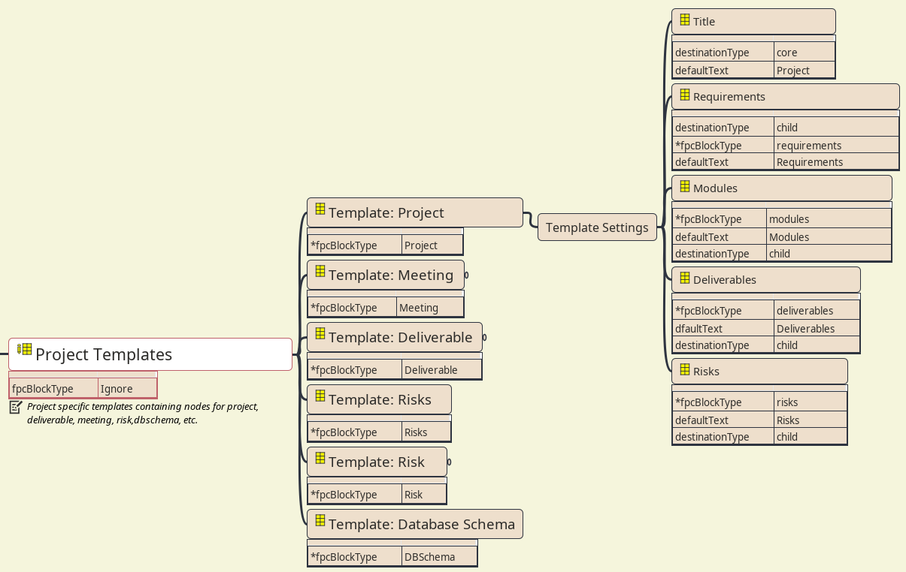|

| |
|:-:|
|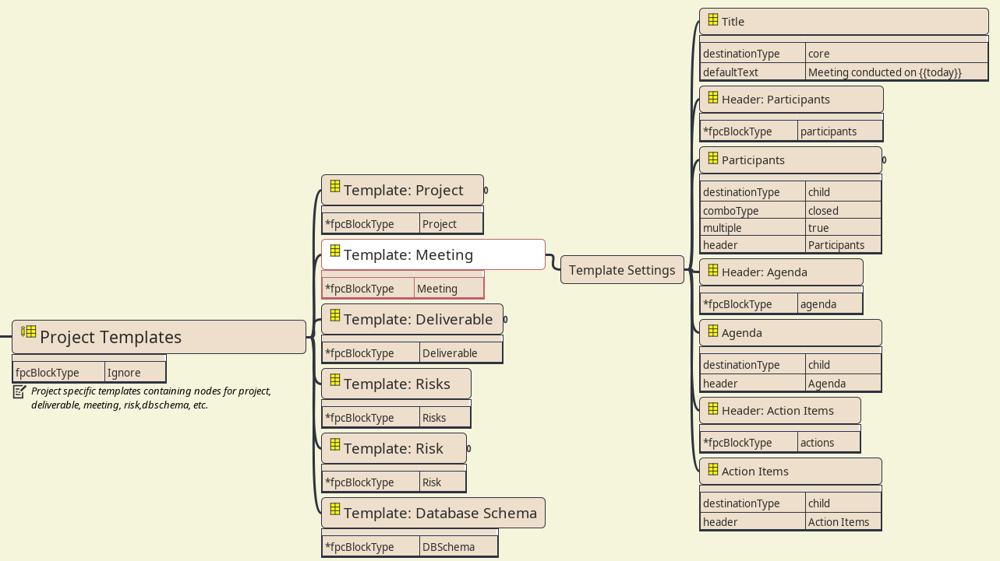|

| |
|:-:|
|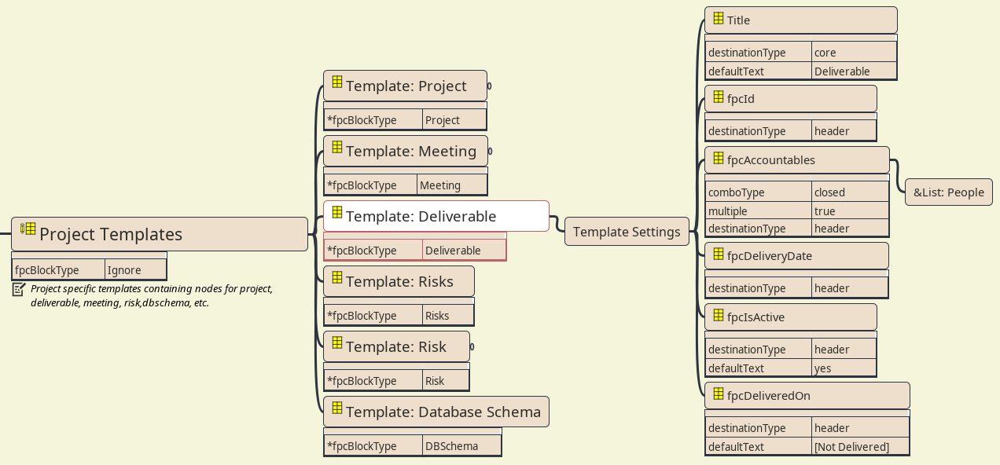|

| |
|:-:|
|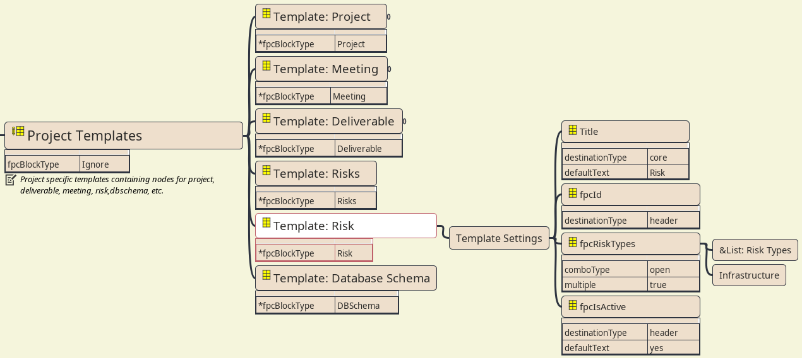|

| |
|:-:|
|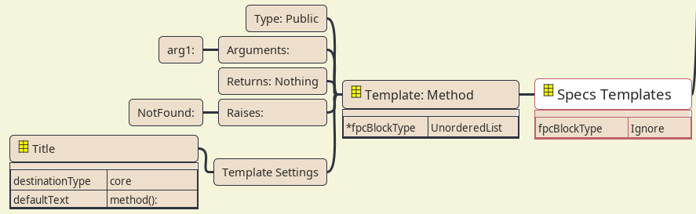|

### Usecase Templates

You can create various usecase-specific nodes dynamically using appropriate node-templates. The usecase-specific node-templates are shown below.

| |
|:-:|
|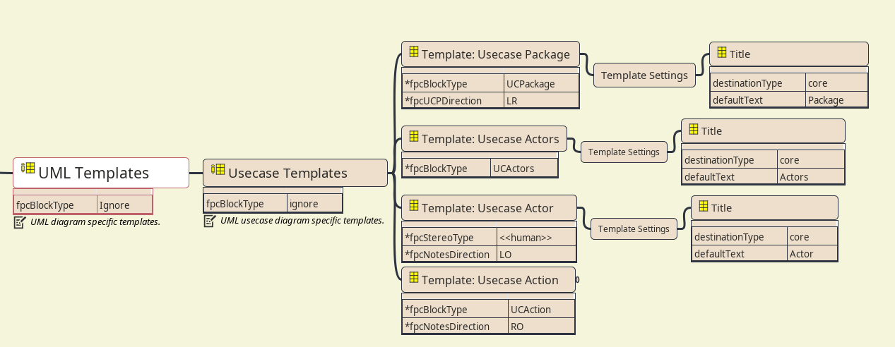|

| |
|:-:|
|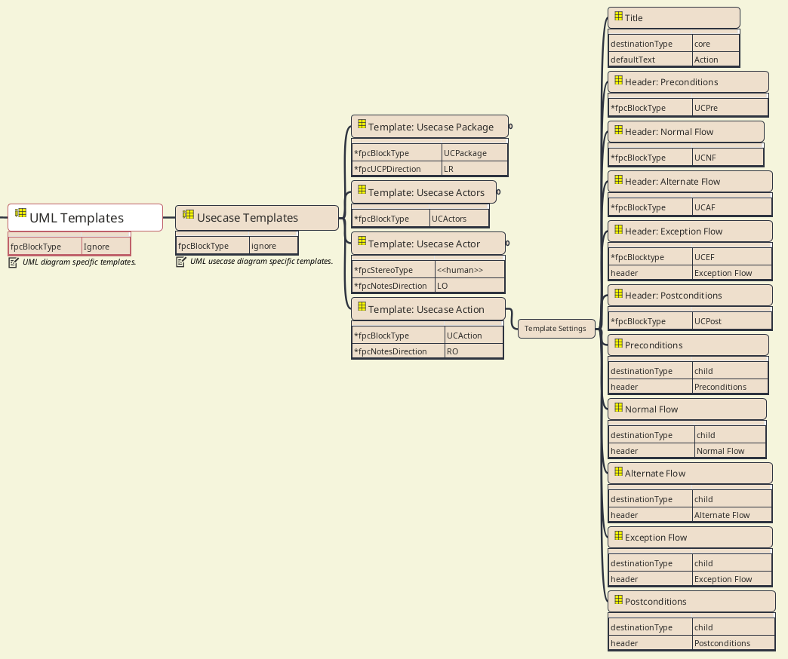|

## Font Styles

All font-styles defined in LaTeX are supported by fp-convert. You may supply font-styles using commandline option `-f` while executing fp-convert. The content from the generated PDF shown above were generated using the following command:

`fp-convert -f nunito Blooper_Specifications.mm Blooper_Specifications.pdf`

There are other variations for the same. One such variation is:

`fp-convert -f "nunito:tabular:scaled=1" Blooper_Specifications.mm Blooper_Specifications.pdf`

You may also change the style completly by running 

`fp-convert -f "roboto:sfdefault:scaled=1.1" Blooper_Specifications.mm Blooper_Specifications.pdf`

which results in the following type of rendering in PDF.

| |
|:-:|
|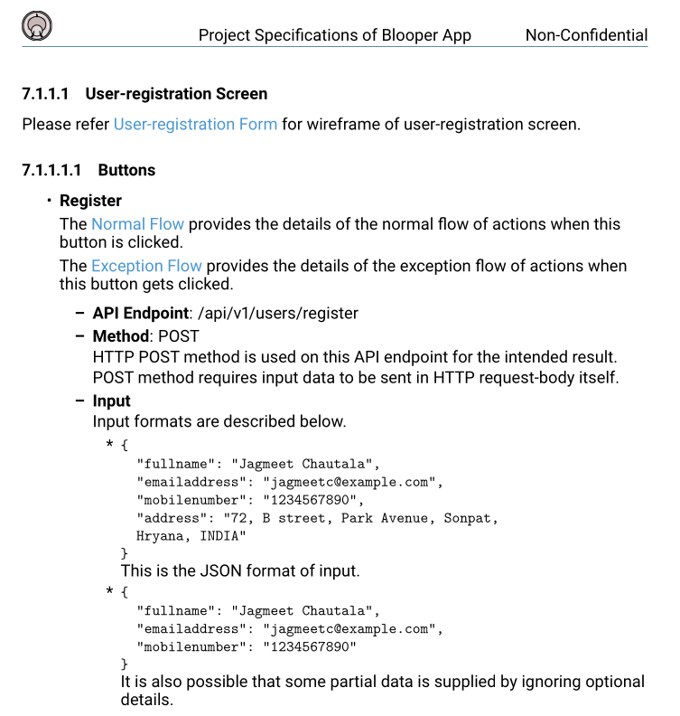|

Running

`fp-convert -f "FiraSans:sfdefault:book:scaled=1.0" Blooper_Specifications.mm Blooper_Specifications.pdf`

generates the following.

| |
|:-:|
|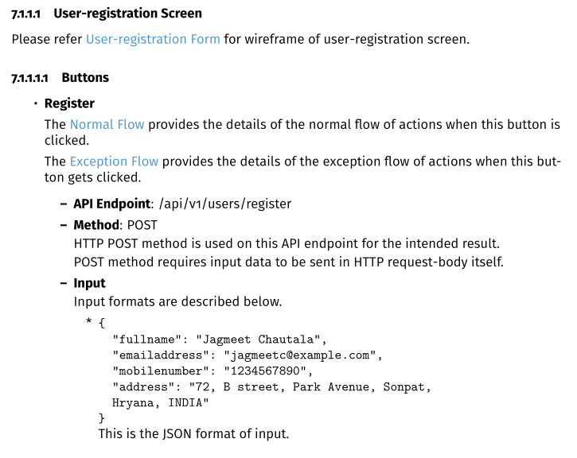|

Running

`fp-convert -f "josefin:sfdefault:light:medium:scaled=1.1" Blooper_Specifications.mm Blooper_Specifications.pdf`

results in generating the PDF as shown below.

| |
|:-:|
|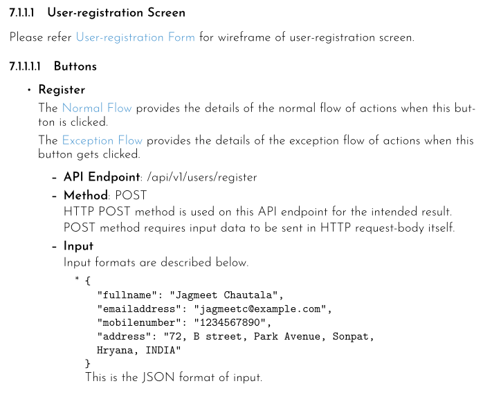|

Running

`fp-convert -f "montserrat:defaultfam:tabular:lining:alternates" Blooper_Specifications.mm Blooper_Specifications.pdf`

generates the following PDF.

| |
|:-:|
|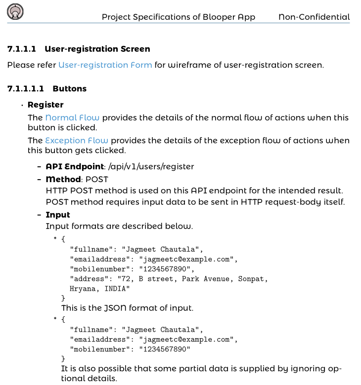|
